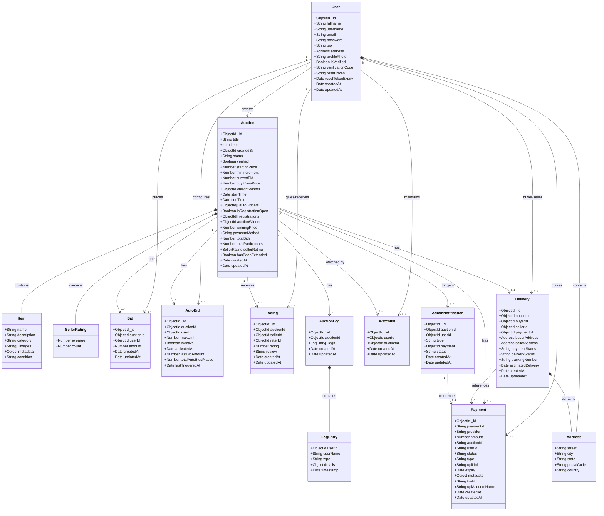

# BidSphere - Class Design Document

## Overview

This document provides a comprehensive class design for the BidSphere Online Auction System. The system consists of 10 main entity classes that work together to provide a complete auction platform experience.

---

## Class Diagram (Mermaid)



---

## Detailed Class Specifications

### 1. User Class

The User class represents all users in the system (Buyers, Sellers, and Admins).

| Attribute | Type | Description | Constraints |
|-----------|------|-------------|-------------|
| _id | ObjectId | Unique identifier | Auto-generated |
| fullname | String | User's full name | Optional |
| username | String | Display name | Required |
| email | String | Email address | Required, Unique |
| password | String | Hashed password | Required |
| bio | String | User biography | Optional |
| address | Address | User's address | Optional (embedded object) |
| profilePhoto | String | Profile image URL | Optional |
| isVerified | Boolean | Email verification status | Default: false |
| verificationCode | String | Email verification code | Optional |
| resetToken | String | Password reset token | Optional |
| resetTokenExpiry | Date | Token expiry time | Optional |
| createdAt | Date | Creation timestamp | Auto-generated |
| updatedAt | Date | Update timestamp | Auto-generated |

**Embedded: Address Object**
| Attribute | Type | Description |
|-----------|------|-------------|
| street | String | Street address |
| city | String | City name |
| state | String | State/Province |
| postalCode | String | Postal/ZIP code |
| country | String | Country name |

---

### 2. Auction Class

The Auction class represents auction listings created by sellers.

| Attribute | Type | Description | Constraints |
|-----------|------|-------------|-------------|
| _id | ObjectId | Unique identifier | Auto-generated |
| title | String | Auction title | Required, Whitespace trimmed |
| item | Item | Item details | Required (embedded object) |
| createdBy | ObjectId | Seller's user ID | Required, References User |
| status | String | Auction status | Required (see Status Enum below) |
| verified | Boolean | Admin verification status | Default: false |
| startingPrice | Number | Initial bid price | Required |
| minIncrement | Number | Minimum bid increment | Required |
| currentBid | Number | Current highest bid | Default: 0 |
| buyItNowPrice | Number | Buy it now price | Optional |
| currentWinner | ObjectId | Current highest bidder | References User |
| startTime | Date | Auction start time | Required |
| endTime | Date | Auction end time | Required |
| autoBidders | ObjectId[] | Users with active autobid | References User |
| isRegistrationOpen | Boolean | Registration status | Default: false |
| registrations | ObjectId[] | Registered bidders | References User |
| auctionWinner | ObjectId | Final winner | References User |
| winningPrice | Number | Final winning price | Optional |
| paymentMethod | String | Payment method | Enum: cod, upi |
| totalBids | Number | Total bid count | Default: 0 |
| totalParticipants | Number | Total participants | Default: 0 |
| sellerRating | SellerRating | Seller's rating | Embedded object |
| hasBeenExtended | Boolean | Extension status | Default: false |
| createdAt | Date | Creation timestamp | Auto-generated |
| updatedAt | Date | Update timestamp | Auto-generated |

**Status Enum Values:**
- `YET_TO_BE_VERIFIED` - Auction created but pending admin verification
- `UPCOMING` - Auction verified and scheduled to start
- `LIVE` - Auction is currently active and accepting bids
- `ENDED` - Auction has ended normally
- `CANCELLED` - Auction was cancelled before completion
- `REMOVED` - Auction was removed by admin

**Embedded: Item Object**
| Attribute | Type | Description |
|-----------|------|-------------|
| name | String | Item name (Required) |
| description | String | Item description |
| category | String | Item category |
| images | String[] | Image URLs |
| metadata | Object | Additional metadata |
| condition | String | Enum: new, like new, good, fair |

**Embedded: SellerRating Object**
| Attribute | Type | Description |
|-----------|------|-------------|
| average | Number | Average rating (Default: 0) |
| count | Number | Total ratings (Default: 0) |

**Indexes:**
- `{ status: 1, endTime: 1 }`
- `{ createdBy: 1 }`
- `{ startTime: 1 }`

---

### 3. Bid Class

The Bid class represents individual bids placed on auctions.

| Attribute | Type | Description | Constraints |
|-----------|------|-------------|-------------|
| _id | ObjectId | Unique identifier | Auto-generated |
| auctionId | ObjectId | Associated auction | Required, References Auction |
| userId | ObjectId | Bidder's ID | Required, References User |
| amount | Number | Bid amount | Required, Min: 0 |
| createdAt | Date | Bid timestamp | Auto-generated |
| updatedAt | Date | Update timestamp | Auto-generated |

**Indexes:**
- `{ auctionId: 1, amount: -1 }`

---

### 4. AutoBid Class

The AutoBid class manages automatic bidding configurations.

| Attribute | Type | Description | Constraints |
|-----------|------|-------------|-------------|
| _id | ObjectId | Unique identifier | Auto-generated |
| auctionId | ObjectId | Associated auction | Required, References Auction |
| userId | ObjectId | User setting autobid | Required, References User |
| maxLimit | Number | Maximum autobid limit | Required |
| isActive | Boolean | Autobid active status | Default: true |
| activatedAt | Date | Activation timestamp | Default: Date.now |
| lastBidAmount | Number | Last autobid amount | Default: 0 |
| totalAutoBidsPlaced | Number | Total autobids placed | Default: 0 |
| lastTriggeredAt | Date | Last trigger time | Optional |

**Indexes:**
- `{ auctionId: 1, userId: 1 }` (Unique)

---

### 5. Payment Class

The Payment class handles all payment transactions.

| Attribute | Type | Description | Constraints |
|-----------|------|-------------|-------------|
| _id | ObjectId | Unique identifier | Auto-generated |
| paymentId | String | Human-friendly ID | Unique, Auto-generated |
| provider | String | Payment provider | Enum: upi, cod (Default: upi) |
| amount | Number | Payment amount | Required |
| auctionId | String | Associated auction | Required |
| userId | String | Payer's ID | Required |
| status | String | Payment status | Enum: PENDING, SUCCESS, FAILED (Default: PENDING) |
| type | String | Payment type | Enum: REGISTRATION FEES, WINNING PAYMENT |
| upiLink | String | UPI payment link | Required |
| expiry | Date | Payment expiry | Required |
| metadata | Object | Additional data | Optional |
| txnId | String | Transaction ID | Optional (for verification) |
| upiAccountName | String | UPI account name | Optional (for verification) |
| createdAt | Date | Creation timestamp | Auto-generated |
| updatedAt | Date | Update timestamp | Auto-generated |

---

### 6. Rating Class

The Rating class stores seller ratings and reviews.

| Attribute | Type | Description | Constraints |
|-----------|------|-------------|-------------|
| _id | ObjectId | Unique identifier | Auto-generated |
| auctionId | ObjectId | Associated auction | Required, References Auction |
| sellerId | ObjectId | Seller being rated | Required, References User |
| raterId | ObjectId | User giving rating | Required, References User |
| rating | Number | Rating value | Required, Min: 1, Max: 5 |
| review | String | Text review | Optional, Trimmed |
| createdAt | Date | Creation timestamp | Auto-generated |
| updatedAt | Date | Update timestamp | Auto-generated |

**Indexes:**
- `{ auctionId: 1, raterId: 1 }` (Unique)

---

### 7. Delivery Class

The Delivery class manages shipping and delivery tracking.

| Attribute | Type | Description | Constraints |
|-----------|------|-------------|-------------|
| _id | ObjectId | Unique identifier | Auto-generated |
| auctionId | ObjectId | Associated auction | Required, References Auction |
| buyerId | ObjectId | Buyer's ID | Required, References User |
| sellerId | ObjectId | Seller's ID | Required, References User |
| paymentId | ObjectId | Associated payment | References Payment |
| buyerAddress | Address | Delivery address | Required (embedded object) |
| sellerAddress | Address | Pickup address | Optional (embedded object) |
| paymentStatus | String | Payment status | Enum: PENDING, CAPTURED, FAILED (Default: PENDING) |
| deliveryStatus | String | Delivery status | Enum: PENDING, PROCESSING, SHIPPED, DELIVERED, CANCELLED (Default: PENDING) |
| trackingNumber | String | Shipment tracking | Optional |
| estimatedDelivery | Date | Expected delivery date | Optional |
| createdAt | Date | Creation timestamp | Auto-generated |
| updatedAt | Date | Update timestamp | Auto-generated |

**Indexes:**
- `{ auctionId: 1 }`
- `{ buyerId: 1 }`
- `{ sellerId: 1 }`
- `{ auctionId: 1, buyerId: 1 }` (Unique)

---

### 8. Watchlist Class

The Watchlist class allows users to track auctions of interest.

| Attribute | Type | Description | Constraints |
|-----------|------|-------------|-------------|
| _id | ObjectId | Unique identifier | Auto-generated |
| userId | ObjectId | User's ID | Required, References User |
| auctionId | ObjectId | Watched auction | Required, References Auction |
| createdAt | Date | Creation timestamp | Auto-generated |
| updatedAt | Date | Update timestamp | Auto-generated |

---

### 9. AuctionLog Class

The AuctionLog class maintains activity history for auctions.

| Attribute | Type | Description | Constraints |
|-----------|------|-------------|-------------|
| _id | ObjectId | Unique identifier | Auto-generated |
| auctionId | ObjectId | Associated auction | Required, Unique, References Auction |
| logs | LogEntry[] | Array of log entries | Embedded array |
| createdAt | Date | Creation timestamp | Auto-generated |
| updatedAt | Date | Update timestamp | Auto-generated |

**Embedded: LogEntry Object**
| Attribute | Type | Description |
|-----------|------|-------------|
| userId | ObjectId | User who triggered event (References User) |
| userName | String | User's name (Required, Default: "System") |
| type | String | Event type (Required) |
| details | Object | Event details (Default: {}) |
| timestamp | Date | Event timestamp (Default: Date.now) |

**LogEntry Type Enum Values:**
- BID_PLACED
- AUTO_BID_TRIGGERED
- AUTO_BID_SET
- AUTO_BID_EDITED
- AUTO_BID_ACTIVATED
- AUTO_BID_DEACTIVATED
- AUCTION_CREATED
- AUCTION_UPDATED
- AUCTION_DELETED
- AUCTION_STARTED
- AUCTION_ENDED
- AUCTION_CANCELLED
- AUCTION_EXTENDED
- AUCTION_WINNER_DECLARED

---

### 10. AdminNotification Class

The AdminNotification class handles notifications for administrative actions.

| Attribute | Type | Description | Constraints |
|-----------|------|-------------|-------------|
| _id | ObjectId | Unique identifier | Auto-generated |
| auctionId | ObjectId | Associated auction | References Auction |
| userId | ObjectId | Related user | References User |
| type | String | Notification type | Required, Enum: see below |
| payment | ObjectId | Related payment | References Payment |
| status | String | Notification status | Enum: PENDING, CONFIRM, REJECT (Default: PENDING) |
| createdAt | Date | Creation timestamp | Auto-generated |
| updatedAt | Date | Update timestamp | Auto-generated |

**Type Enum Values:**
- `PAYMENT VERIFICATION` - Payment needs admin verification
- `WINNER CHOOSE COD` - Winner selected Cash on Delivery
- `WINNER CHOOSE UPI` - Winner selected UPI payment
- `PAYMENT_SUCCESS_DELIVERY_PENDING` - Payment confirmed, delivery pending

> **Note:** The type enum values use inconsistent formatting (spaces vs underscores) as defined in the model.

---

## Class Relationships Summary

### One-to-Many Relationships

| Parent | Child | Description |
|--------|-------|-------------|
| User | Auction | A user (seller) can create many auctions |
| User | Bid | A user can place many bids |
| User | AutoBid | A user can set multiple autobid configurations |
| User | Rating | A user can give and receive multiple ratings |
| User | Watchlist | A user can watch multiple auctions |
| User | Payment | A user can make multiple payments |
| Auction | Bid | An auction can have many bids |
| Auction | AutoBid | An auction can have multiple autobid configurations |
| Auction | Watchlist | An auction can be watched by many users |
| Auction | Payment | An auction can have multiple payments |
| Auction | Rating | An auction can receive multiple ratings |
| Auction | AdminNotification | An auction can trigger multiple notifications |

### One-to-One Relationships

| Entity A | Entity B | Description |
|----------|----------|-------------|
| Auction | AuctionLog | Each auction has exactly one log |
| Auction | Delivery | Each completed auction has one delivery record |

### Many-to-Many Relationships

| Entity A | Entity B | Join Entity | Description |
|----------|----------|-------------|-------------|
| User | Auction | Watchlist | Users watch auctions through Watchlist |
| User | Auction | Bid | Users participate in auctions through Bids |

---

## State Diagrams

### Auction Status Flow

```
┌─────────────────────┐
│  YET_TO_BE_VERIFIED │
└──────────┬──────────┘
           │ (Admin verifies)
           ▼
    ┌──────────────┐
    │   UPCOMING   │
    └──────┬───────┘
           │ (Start time reached)
           ▼
    ┌──────────────┐
    │     LIVE     │◄──────┐
    └──────┬───────┘       │ (Extended)
           │               │
           ├───────────────┘
           │ (End time reached)
           ▼
    ┌──────────────┐
    │    ENDED     │
    └──────────────┘

  ┌──────────────┐      ┌──────────────┐
  │  CANCELLED   │      │   REMOVED    │
  └──────────────┘      └──────────────┘
  (Can occur from any state except ENDED)
```

### Payment Status Flow

```
┌──────────────┐
│   PENDING    │
└──────┬───────┘
       │
       ├────────────────┐
       │                │
       ▼                ▼
┌──────────────┐  ┌──────────────┐
│   SUCCESS    │  │    FAILED    │
└──────────────┘  └──────────────┘
```

### Delivery Status Flow

```
┌──────────────┐
│   PENDING    │
└──────┬───────┘
       │
       ▼
┌──────────────┐
│  PROCESSING  │
└──────┬───────┘
       │
       ▼
┌──────────────┐
│   SHIPPED    │
└──────┬───────┘
       │
       ▼
┌──────────────┐
│  DELIVERED   │
└──────────────┘

┌──────────────┐
│  CANCELLED   │
└──────────────┘
(Can occur from PENDING, PROCESSING, or SHIPPED)
```

---

## Design Patterns Used

### 1. Repository Pattern
The model classes serve as repositories for MongoDB collections, encapsulating data access logic.

### 2. Embedded Document Pattern
Used for Address, Item, SellerRating, and LogEntry to reduce join operations.

### 3. Reference Pattern
Used for relationships between main entities (User, Auction, Payment, etc.) using ObjectId references.

### 4. Index Pattern
Strategic indexes are defined for frequently queried fields to optimize performance.

---

## Notes

1. All classes use MongoDB ObjectId as the primary identifier (`_id`)
2. Timestamps (`createdAt`, `updatedAt`) are automatically managed by Mongoose
3. Embedded objects don't have separate `_id` fields (except implicitly by MongoDB)
4. The system uses a mix of embedding (for closely related data) and referencing (for loosely coupled entities)
5. Unique constraints are enforced through Mongoose schema definitions and MongoDB indexes

---

*This document reflects the current class design as of the latest sprint implementation.*
